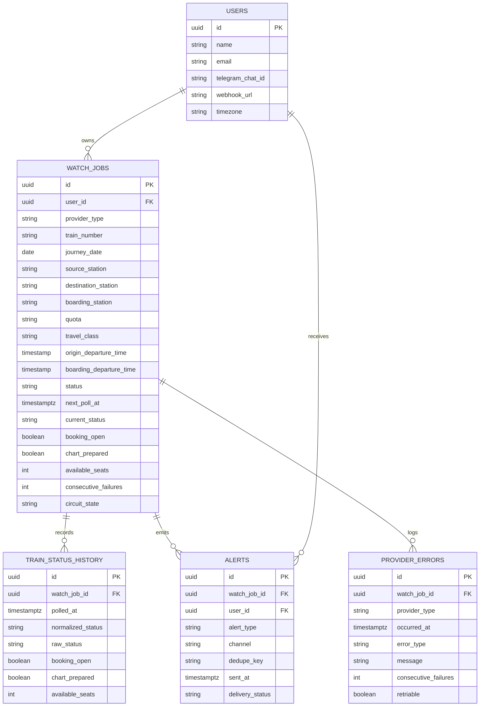

# ER Diagram

```mermaid
erDiagram
    USERS ||--o{ WATCH_JOBS : owns
    WATCH_JOBS ||--o{ TRAIN_STATUS_HISTORY : records
    WATCH_JOBS ||--o{ ALERTS : emits
    WATCH_JOBS ||--o{ PROVIDER_ERRORS : logs
    USERS ||--o{ ALERTS : receives

    USERS {
      uuid id PK
      string name
      string email
      string telegram_chat_id
      string webhook_url
      string timezone
    }

    WATCH_JOBS {
      uuid id PK
      uuid user_id FK
      string provider_type
      string train_number
      date journey_date
      string source_station
      string destination_station
      string boarding_station
      string quota
      string travel_class
      timestamp origin_departure_time
      timestamp boarding_departure_time
      string status
      timestamptz next_poll_at
      string current_status
      boolean booking_open
      boolean chart_prepared
      int available_seats
      int consecutive_failures
      string circuit_state
    }

    TRAIN_STATUS_HISTORY {
      uuid id PK
      uuid watch_job_id FK
      timestamptz polled_at
      string normalized_status
      string raw_status
      boolean booking_open
      boolean chart_prepared
      int available_seats
    }

    ALERTS {
      uuid id PK
      uuid watch_job_id FK
      uuid user_id FK
      string alert_type
      string channel
      string dedupe_key
      timestamptz sent_at
      string delivery_status
    }

    PROVIDER_ERRORS {
      uuid id PK
      uuid watch_job_id FK
      string provider_type
      timestamptz occurred_at
      string error_type
      string message
      int consecutive_failures
      boolean retriable
    }
```
